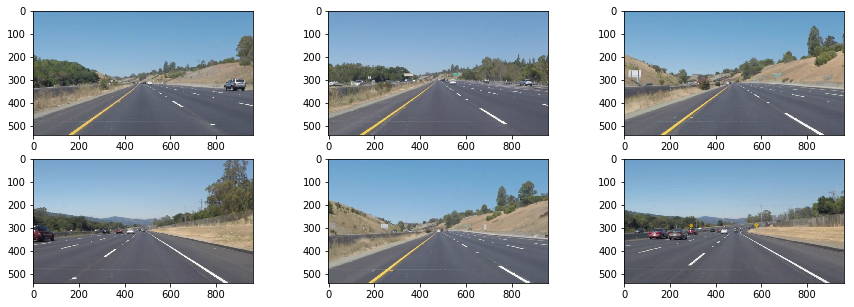

# Self-Driving Car Engineer Nanodegree


## Project: **Finding Lane Lines on the Road** 
***

In this project I made a pipeline for finding lane lines on the road 😃

some used functions is : 
* `select_white_yellow` is used for just selecting white and yellow pixels in image 🖼🖼
* `grayscale` is used for grayscaling image
* `apply_smoothing` is used for applying 
* `canny` is used for detecting lines
* `region_of_interest` is used for just selecting lines in street
* `hough_lines` is used for get lines point
* `lane_lines` is used for combine lines into right and left lines
* `draw_lines` is used for drawing lines of image
* `show_images` is used for showing images
---

## Import Packages
The following libraries are used.  `cv2` is for OpenCV.

Matplotlib is using to showing images.

numpy is for working with numbers.

VideoFileClip is for working with video frames


```python
#importing some useful packages
import matplotlib.pyplot as plt
import matplotlib.image as mpimg
import numpy as np
import cv2
import os, glob
from moviepy.editor import VideoFileClip
%matplotlib inline
```

## Reading images
This function is used to read a set of 6 images and showing them in a figure.


```python
def show_images(images):
    cols = 3
    rows = 2
    plt.figure(figsize=(15, 5))
    for i in range(0, len(images)):
        plt.subplot(rows, cols, i+1)
        plt.imshow(images[i], cmap="gray")
    plt.show()

```

now if you want to test `show_images` function you should use it like this : 


```python
test_images = []
test_images = [plt.imread(path) for path in glob.glob('test_images/*.jpg')]

show_images(test_images)

```





## Changing color of Images


### Select white and yellow lanes 
This function just select yellow and white colors. It's better to finding lanes with this function. because most of image is useless.

* I Use `cv2.inRange` to filter the white color and the yellow color seperately.  
  The function returns 255 when the filter conditon is satisfied.  Otherwise, it returns 0.
* I Use `cv2.bitwise_or` to combine these two binary masks.  
  The combined mask returns 255 when either white or yellow color is detected.
* I Use `cv2.bitwise_and` to apply the combined mask onto the original RGB image


```python
def select_white_yellow(image):
    # white color mask
    lower = np.uint8([200, 200, 200])
    upper = np.uint8([255, 255, 255])
    white_mask = cv2.inRange(image, lower, upper)
    # yellow color mask
    lower = np.uint8([190, 190,   0])
    upper = np.uint8([255, 255, 255])
    yellow_mask = cv2.inRange(image, lower, upper)
    # combine the mask
    mask = cv2.bitwise_or(white_mask, yellow_mask)
    masked = cv2.bitwise_and(image, image, mask = mask)
    return masked
white_yellow_images = list(map(select_white_yellow, test_images))

show_images(white_yellow_images)
```


### GrayScale 
This function change color of an image to `grayscale` .
It reduce noises and other functions can apply on image better.
It select white and yellow as a color and others as blak


```python
def grayscale(image):
    return cv2.cvtColor(image, cv2.COLOR_RGB2GRAY)

gray_images = list(map(grayscale, white_yellow_images))
show_images(gray_images)
```


### Gaussian

At last we use gaussian function to smooth white yellow images


```python
def apply_smoothing(image):
    kernel_size=15
    return cv2.GaussianBlur(image, (kernel_size, kernel_size), 0)
blurred_images = list(map(apply_smoothing, gray_images))
show_images(blurred_images)
```


## Lane Detection Functions 


## Canny Function

There is some information about this function in openCV :
* If a pixel gradient is higher than the upper threshold, the pixel is accepted as an edge
* If a pixel gradient value is below the lower threshold, then it is rejected.
* If the pixel gradient is between the two thresholds, then it will be accepted only if it is connected to a pixel that is above the upper threshold.

**So we can select lines easily with this functions. just by selecting this threshold for yellow and white lanes we can select them**


```python
def canny(image):
    low_threshold=50
    high_threshold=150
    return cv2.Canny(image, low_threshold, high_threshold)

edge_images = list(map(canny, blurred_images))
show_images(edge_images)
```


## Region of Interest

Now in this images we don't need to see sky. As you see some lane detected in the sky that we don't need them.
so we just select street from them.

For selecting that we just choose a polygon that is prespective street.


```python
def region_of_interest(img):
    # define the polygon by vertices
    rows, cols = img.shape[:2]
    bottom_left  = [cols*0.1, rows*0.95]
    top_left     = [cols*0.4, rows*0.6]
    bottom_right = [cols*0.9, rows*0.95]
    top_right    = [cols*0.6, rows*0.6] 
    vertices = np.array([[bottom_left, top_left, top_right, bottom_right]], dtype=np.int32)
    #defining a blank mask to start with
    mask = np.zeros_like(img)   
    #defining a 3 channel or 1 channel color to fill the mask with depending on the input image
    if len(img.shape) > 2:
        channel_count = img.shape[2]  # i.e. 3 or 4 depending on your image
        ignore_mask_color = (255,) * channel_count
    else:
        ignore_mask_color = 255
    #filling pixels inside the polygon defined by "vertices" with the fill color    
    cv2.fillPoly(mask, vertices, ignore_mask_color)
    #returning the image only where mask pixels are nonzero
    masked_image = cv2.bitwise_and(img, mask)
    return masked_image

roi_images = list(map(region_of_interest, edge_images))
show_images(roi_images)
```


## Drawing lines 

For drawing lines we use this function. 


```python
def draw_lines(img, lines, color=[255, 0, 0], thickness=2):
    imgCopy = np.copy(img)
    for line in lines:
        for x1,y1,x2,y2 in line:
            cv2.line(imgCopy, (x1, y1), (x2, y2), color, thickness)
    return imgCopy
```

And for detecting lines in our smoothed images we use `hough_lines`

Some parameters should pass to `HoughLinesP` which according to openCV doc are :
* rho – Distance resolution of the accumulator in pixels.
* theta – Angle resolution of the accumulator in radians.
* threshold – Accumulator threshold parameter. (> `threshold`).
* min_line_length – Minimum line length.
* max_line_gap – Maximum allowed gap between points on the same line to link them.


```python
def hough_lines(img):
    rho=1
    theta=np.pi/180
    threshold=20
    min_line_length=20
    max_line_gap=300
    return cv2.HoughLinesP(img, rho, theta, threshold, np.array([]), minLineLength=min_line_length, maxLineGap=max_line_gap)
```

At last result of these functions on smoothed images are like this :


```python
list_of_lines = list(map(hough_lines, roi_images))
line_images = []
for image, lines in zip(test_images, list_of_lines):
    line_images.append(draw_lines(image, lines))
show_images(line_images)
```


## Show lines better and averaging them

These lines are not smooth in image. Because there are multiple lines in images. We should get them and add an average line instead of them. 

At last we should just average all lines into two lines ( left and right ).  we'll collect positive slope lines and negative slope lines separately and take averages.


```python
def average_slope_intercept(lines):
    left_lines    = [] # (slope, intercept)
    left_weights  = [] # (length,)
    right_lines   = [] # (slope, intercept)
    right_weights = [] # (length,)
    
    for line in lines:
        for x1, y1, x2, y2 in line:
            if x2==x1:
                continue # ignore a vertical line
            slope = (y2-y1)/(x2-x1)
            intercept = y1 - slope*x1
            length = np.sqrt((y2-y1)**2+(x2-x1)**2)
            if slope < 0: # y is reversed in image
                left_lines.append((slope, intercept))
                left_weights.append((length))
            else:
                right_lines.append((slope, intercept))
                right_weights.append((length))
    # add more weight to longer lines    
    left_lane  = np.dot(left_weights,  left_lines) /np.sum(left_weights)  if len(left_weights) >0 else None
    right_lane = np.dot(right_weights, right_lines)/np.sum(right_weights) if len(right_weights)>0 else None
    
    return left_lane, right_lane # (slope, intercept), (slope, intercept)
```

 I need to convert the slope and intercept into pixel points. so `lane_line` is for changing them two pixel and collect their results.


```python
def lane_lines(image, lines):
    left_lane, right_lane = average_slope_intercept(lines)
    
    y1 = image.shape[0] # bottom of the image
    y2 = y1*0.6         # slightly lower than the middle
    
    if (left_lane is None) or (right_lane is None) :
        raise Exception('not detecting')

    slope, intercept = left_lane
    x1 = int((y1 - intercept)/slope)
    x2 = int((y2 - intercept)/slope)
    y1 = int(y1)
    y2 = int(y2)
    
    left_line = ((x1, y1), (x2, y2))
    
    slope, intercept = right_lane
    x1 = int((y1 - intercept)/slope)
    x2 = int((y2 - intercept)/slope)
    y1 = int(y1)
    y2 = int(y2)
    
    right_line = ((x1, y1), (x2, y2))
    return left_line, right_line
```

and at last we show these two lines with our `draw_lane_lines` function.


```python
def draw_lane_lines(image, lines, color=[255, 0, 0], thickness=20):
    line_image = np.zeros_like(image)
    for line in lines:
        if line is not None:
            cv2.line(line_image, *line,  color, thickness)
    return cv2.addWeighted(image, 1.0, line_image, 0.95, 0.0)
             
    
lane_images = []
for image, lines in zip(test_images, list_of_lines):
    lane_images.append(draw_lane_lines(image, lane_lines(image, lines)))

    
show_images(lane_images)
```


# Image Lane Finding Pipeline

so at last our lane finding pipeline should be something like this : 


```python
def process_image(image):
    try :
        white_yellow_image = select_white_yellow(image)
        gray_image = grayscale(image)
        blurred_image = apply_smoothing(gray_image)
        edge_image = canny(blurred_image)
        roi_image = region_of_interest(edge_image)
        list_of_lines = hough_lines(roi_image)
        result = draw_lane_lines(image, lane_lines(image, list_of_lines))
        return result
    except Exception as error:
        return image


test_images = [plt.imread(path) for path in glob.glob('test_images/*.jpg')]
lane_images = []
for image in test_images :
    lane_images.append(process_image(image))
show_images(lane_images)
```


# Video Lane Finding 

For detecting lanes in video we use our pipeline as `process_image` for every frame of video


```python
def process_video(video_input, video_output):
    white_output = 'test_videos_output/' + video_output
    clip1 = VideoFileClip("test_videos/" + video_input)
    white_clip = clip1.fl_image(process_image) #NOTE: this function expects color images!!
    %time white_clip.write_videofile(white_output, audio=False)
```


```python
process_video('solidWhiteRight.mp4', 'solidWhiteRight.mp4') 
process_video('challenge.mp4', 'challenge.mp4') 
process_video('solidYellowLeft.mp4', 'solidYellowLeft.mp4') 
```

    [MoviePy] >>>> Building video test_videos_output/solidWhiteRight.mp4
    [MoviePy] Writing video test_videos_output/solidWhiteRight.mp4


    100%|█████████▉| 221/222 [00:05<00:00, 42.56it/s]


    [MoviePy] Done.
    [MoviePy] >>>> Video ready: test_videos_output/solidWhiteRight.mp4 
    
    CPU times: user 2.83 s, sys: 331 ms, total: 3.16 s
    Wall time: 6.03 s
    [MoviePy] >>>> Building video test_videos_output/challenge.mp4
    [MoviePy] Writing video test_videos_output/challenge.mp4


    100%|██████████| 251/251 [00:13<00:00, 19.15it/s]


    [MoviePy] Done.
    [MoviePy] >>>> Video ready: test_videos_output/challenge.mp4 
    
    CPU times: user 5.7 s, sys: 761 ms, total: 6.46 s
    Wall time: 14.7 s
    [MoviePy] >>>> Building video test_videos_output/solidYellowLeft.mp4
    [MoviePy] Writing video test_videos_output/solidYellowLeft.mp4


    100%|█████████▉| 681/682 [00:18<00:00, 37.08it/s]


    [MoviePy] Done.
    [MoviePy] >>>> Video ready: test_videos_output/solidYellowLeft.mp4 
    
    CPU times: user 8.84 s, sys: 1.09 s, total: 9.93 s
    Wall time: 19.3 s


**You can see these video results below :**


```python
from IPython.display import HTML
HTML("""
<table>
    <tr>
        <td> <video width="320" height="240" controls> <source src="{0}"> </video> </td>
        <td> <video width="320" height="240" controls> <source src="{1}"> </video> </td>
        <td> <video width="320" height="240" controls> <source src="{2}"> </video> </td>
    <tr>
    
</table>

""".format("test_videos_output/solidWhiteRight.mp4", "test_videos_output/solidYellowLeft.mp4", "test_videos_output/challenge.mp4"))
```


<table>
    <tr>
        <td> <video width="320" height="240" controls> <source src="test_videos_output/solidWhiteRight.mp4"> </video> </td>
        <td> <video width="320" height="240" controls> <source src="test_videos_output/solidYellowLeft.mp4"> </video> </td>
        <td> <video width="320" height="240" controls> <source src="test_videos_output/challenge.mp4"> </video> </td>
    <tr>
    
</table>


